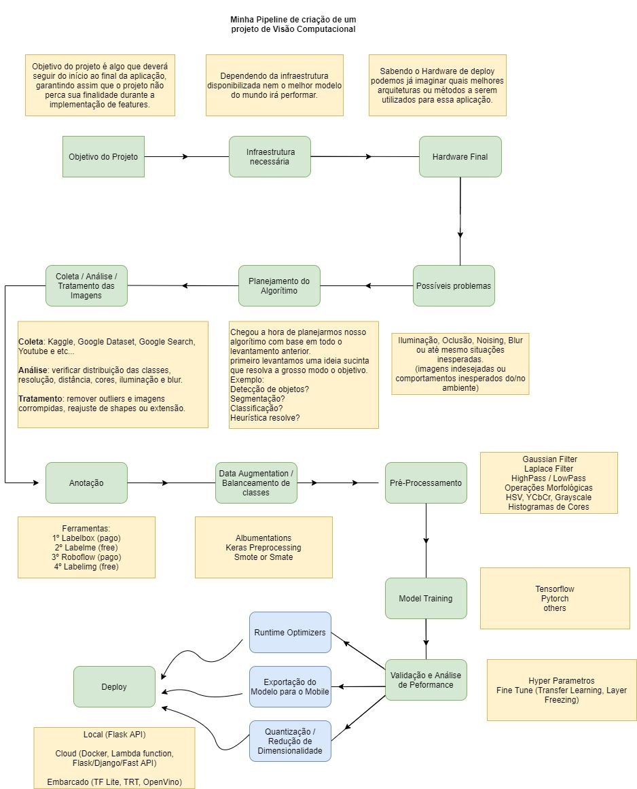

# Tutoriais de Visão Computacional e Processamento de Imagens

- [Grupo de OpenCV Brasil -  Telegram](https://t.me/opencvBrasil)

 

## Review de Artigos 

- [Sik-Ho Tsang](https://sh-tsang.medium.com/)
- [Jonathan Hui](https://jonathan-hui.medium.com/)

 

## Livros

- [Computer Vision: Theory and Application - Rick Szeliski](http://szeliski.org/Book/)
- [PyTorch Computer Vision Cookbook](https://github.com/PacktPublishing/PyTorch-Computer-Vision-Cookbook)
- [Hands-On Computer Vision with TensorFlow 2](https://github.com/PacktPublishing/Hands-On-Computer-Vision-with-TensorFlow-2)
- [Mastering Computer Vision with TensorFlow 2.x](https://github.com/PacktPublishing/Mastering-Computer-Vision-with-TensorFlow-2.0)
- [Diversos Livros de Machine Learnin, Deep Learning, CV e RL](https://github.com/changwookjun/StudyBook)
- [Multiple View Geometry in Computer Vision - Richard Hartley and Andrew Zisserman](http://www.robots.ox.ac.uk/~vgg/hzbook/)

 

## Processamento de imagens [Abordagem matemática]

- [Curso Online - Processamento de Imagens (2020), IMPA](https://www.youtube.com/playlist?list=PLo4jXE-LdDTRaFa39TdNN3FgPAKkcuHvj)

 

## Cursos

- [High Performance Computing](https://classroom.udacity.com/courses/ud281)
- [High Performance Computer Architecture](https://classroom.udacity.com/courses/ud007)
- [Programa de cursos integrados Aprendizagem profunda](https://www.coursera.org/specializations/deep-learning)
- [Programa de cursos integrados Matemática para aprendizagem automática](https://pt.coursera.org/specializations/mathematics-machine-learning)
- [TensorFlow: Advanced Techniques Specialization](https://www.coursera.org/specializations/tensorflow-advanced-techniques)
- [Machine Learning Engineering for Production (MLOps) Specialization](https://www.coursera.org/specializations/machine-learning-engineering-for-production-mlops)
- [Generative Adversarial Networks (GANs) Specialization](https://www.coursera.org/specializations/generative-adversarial-networks-gans)

 

## Books

- [Deep Learning, Ian Goodfellow and Yoshua Bengio and Aaron Courville](https://www.deeplearningbook.org/)
- [Deep Learning Book, Português](http://deeplearningbook.com.br/)
- [PyTorch Computer Vision Cookbook](https://github.com/PacktPublishing/PyTorch-Computer-Vision-Cookbook)
- [Hands-On Computer Vision with TensorFlow 2](https://github.com/PacktPublishing/Hands-On-Computer-Vision-with-TensorFlow-2)
- [Mastering Computer Vision with TensorFlow 2.x](https://github.com/PacktPublishing/Mastering-Computer-Vision-with-TensorFlow-2.0)
- [Diversos Livros de Machine Learnin, Deep Learning, CV e RL](https://github.com/changwookjun/StudyBook)
- [Python Data Science Handbook - Jake VanderPlas](https://jakevdp.github.io/PythonDataScienceHandbook/)
- [Understanding Machine Learning - Shai Shalev-Shwartz and Shai Ben-David](https://www.cs.huji.ac.il/~shais/UnderstandingMachineLearning/copy.html)
- [Data Mining and Machine Learning - Mohammed J. Zaki, Wagner Meira, Jr.](https://dataminingbook.info/book_html/)
- [Machine Learning and Big Data - Kareem Alkaseer](http://www.kareemalkaseer.com/books/ml/)
- [Multiple View Geometry in Computer Vision - Richard Hartley and Andrew Zisserman](http://www.robots.ox.ac.uk/~vgg/hzbook/)

 

# Documentação Oficial e libs interessantes.

 -  [OpenCV 4.4.0](https://docs.opencv.org/4.4.0/)
 -  [Python 3.8](https://docs.python.org/pt-br/3/)
 -  [Gluon CV](https://gluon-cv.mxnet.io/)
 -  [Point Cloud Library PCL 1.11](https://pointclouds.org/documentation/)
 -  [Tensor Flow](https://www.tensorflow.org/?hl=pt-br)
 -  [Pytorch](https://pytorch.org/docs/stable/index.html)
 -  [Caffe](https://caffe.berkeleyvision.org/)
 -  [Theano](http://deeplearning.net/software/theano/)
 -  [SimpleITK](https://simpleitk.org/)
 -  [Mahotas](https://mahotas.readthedocs.io/en/latest/)

 

# Universidades Estrangeiras.

-  [Stanford University School of Engineering |Lecture Collection | Convolutional Neural Networks for Visual Recognition (Spring 2017)](https://www.youtube.com/watch?v=vT1JzLTH4G4&list=PL3FW7Lu3i5JvHM8ljYj-zLfQRF3EO8sYv)
-  [MIT A 2020 Vision of Linear Algebra, Spring 2020, MIT OpenCourseWare](https://www.youtube.com/watch?v=YrHlHbtiSM0&list=PLUl4u3cNGP61iQEFiWLE21EJCxwmWvvek)

 

# Inteligência Artificial

- [Inteligência Artificial em saúde: o uso de machine learning, Alexandre Chiavegatto](https://www.youtube.com/playlist?list=PLAudUnJeNg4tvUFZ8tXQDoAkFAASQzOHm&disable_polymer=true)

 

# Canais Interessantes

- [Programação Dinâmica](https://www.youtube.com/c/Programa%C3%A7%C3%A3oDin%C3%A2mica/)
- [Python Pro](https://www.youtube.com/channel/UCGjx62365UJ8XTWU_5GZC-g)
- [Eduardo Mendes](https://www.youtube.com/channel/UCAaKeg-BocRqphErdtIUFFw)
- [Filipe Deschamps](https://www.youtube.com/channel/UCU5JicSrEM5A63jkJ2QvGYw)
- [LINUXtips](https://www.youtube.com/channel/UCJnKVGmXRXrH49Tvrx5X0Sw)
- [MIT OpenCourseWare](https://www.youtube.com/channel/UCEBb1b_L6zDS3xTUrIALZOw)
- [stanfordonline](https://www.youtube.com/user/stanfordonline/playlists)
- [freeCodeCamp.org](https://www.youtube.com/channel/UC8butISFwT-Wl7EV0hUK0BQ)

 

## Referências Importantes.

- [Learn OpenCV, Satya Mallick](https://www.learnopencv.com/)
- [PyImageSearch, Adrian Rosebrock,](https://www.pyimagesearch.com/)

 

## Pipeline para construção de algoritmos e produtos para Visão Computacional

 

Referência : [Nicolas Melo](https://www.linkedin.com/in/n%C3%ADcolas-melo-bsb/) 
Post Original :  [Minha Pipeline de criação  de um  projeto de visão computacional](https://www.linkedin.com/feed/update/urn:li:activity:6810534108452716545/)
