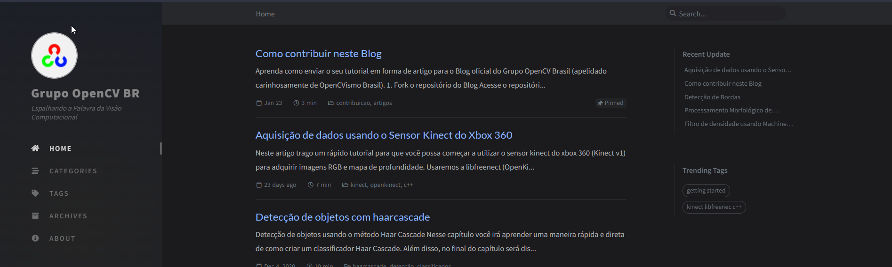

# COOKBOOK DE VISÃO COMPUTACIONAL PARA INICIANTES

Projeto iniciado e executado pela comunidade de OpenCV Brasil no Telegram, tendo como Objetivo divulgar os conhecimentos sobre Visão Computacional

Neste cookbook você vai encontrar projetos rápidos elaborados para te introduzir ao mundo da Visão Computacional (ou até mesmo para refrescar sua memória sobre alguns temas).

- [CookBook OpenCVismo Brasil](https://grupo-opencv-br.github.io/)
  

*"Espalhando a Palavra da Visão Computacional"*

  

Contribuidores :

- [Natalia Carvalho](https://www.linkedin.com/in/natalia-carvalho-02901798/)
- [Elton Fernandes dos Santos](https://www.linkedin.com/in/eltonfernandesdossantos/) 
- [Luis Fernando](https://www.linkedin.com/in/luisferreira13/)
- [Willian Jesus da Silva](https://www.linkedin.com/in/willian-jesus-da-silva/)

