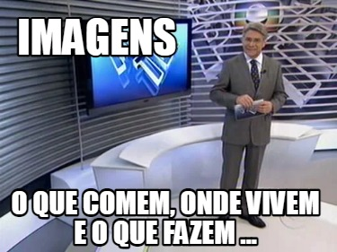

# Imagem

## O que é, onde vivem e o que comem ?

Mas então, o que é uma imagem ?

Uma imagem é a captura da reflexão da luz no objeto.

Ok, não entendi.

Temos que lembrar que a origem do nome fotografia vem do grego fótons (luz), grafia ( escrever), ou seja, escrever ou gravar a luz em alguma superficie, Cortella Fellings ...

## A produção de uma imagem

Quando olhamos para uma cena qualquer, não estamos sentindo diretamente os objetos que a compõem, mas sim a luz refletida por eles. Esta cena também inclui as próprias fontes luminosas e - tão importante quanto estas duas - áreas menos iluminadas. A cena que vemos é composta por um infinito número de pontos com diferentes níveis de luminosidade.

Cada ponto nesta cena é muitas vezes iluminado por um bom número de fontes luminosas, cada uma contribuindo para a qualidade da iluminação. Em uma cena externa, a fonte principal é obviamente o sol, mas também todo o céu e a luz refletida pelos objetos também contribuirão para a qualidade da iluminação.

Os raios luminosos são refletidos por cada ponto em todas as direções. Isto é fácil de demonstrar: eu observo um objeto qualquer em uma determinada posição. Ao me deslocar, mudando o ponto de vista, eu continuo vendo este objeto; portanto, a luz é refletida por ele em todas as direções.

Quando produzimos uma imagem (seja com uma câmera, ou com nosso próprio olho) o que de fato vemos são estes pontos luminosos, raios que se deslocaram do objeto até nosso olho em linha reta. Isto também é simples de demonstrar: se entre o observador e o objeto é colocado uma superfície opaca, não se vê mais o objeto, pois os raios de luz não fazem curvas!

A fotografia e a projeção de imagens existem pelo mesmo motivo que nos leva a enxergar. A fim de produzir uma imagem, precisamos que para cada ponto da cena original exista um ponto luminoso correspondente, registrado em uma superfície bidimensional. A reunião de todos estes pontos formará a imagem. Mas se só estendermos um papel fotográfico, não teremos uma imagem, pois cada ponto da cena iluminará ou não (dependendo do ponto) todos os pontos do cartão da mesma forma, criando um cinza uniforme, e não uma imagem.

Para formar uma imagem (uma projeção visível), temos que restringir a luz deste ponto (fonte) para iluminar (formar) apenas um ponto luminoso na superfície dessa imagem. O comum em uma câmera fotográfica é o trabalho da lente convergente e direcionar os raios dispersos em uma reflexão em um único ponto em nosso plano de projeção, onde está o filme.

Outra maneira é restringir a abertura por onde passa a luz, fazendo com que só um estreito feixe de luz refletida pela cena chegue ao plano de imagem. E por sua trajetória retilínea característica , estes poucos raios iluminarão apenas um ponto no plano da imagem, compondo com os demais pontos a imagem.

Quanto maior for a abertura feita, maior será a faixa de raios interceptada, e mais pontos serão formados, provocando maior interseção entre eles. Isto irá afetar diretamente na nitidez dessa imagem. Portanto, este furo deve ser o menor possível, e é por isso que, em inglês, recebe o nome de pinhole (buraco de agulha).

Existem diferenças ao utilizarmos lentes, um espelho curvado ou um furo para obter imagens. A lente convergente apanha a luz de uma grande área, concentrando - em um plano de projeção, criando uma imagem muito mais luminosa. Sendo esta sua principal vantagem, é a escolha na manufatura das câmeras fotográficas convencionais.

Mesmo assim, a pinhole apresenta suas vantagens. Lentes são, de longe, muito mais difíceis de serem manufaturadas e ajustadas, envolve um trabalho extremamente qualificado e preciso. Já a tolerância admitida pela abertura pinhole para a formação de uma imagem permite que qualquer pessoa possa construir uma câmera. E muito do conhecimento necessário para entender a fotografia está, em sua forma mais simples, na fotografia pinhole.

[Fonte:  IF UFRGS](imagens/image012.gifl)

 
 
 
 
 
 
 
 
 

Abaixo deixarei um video sobre a câmera de Pinhole.

<iframe width="1904" height="772" src="https://www.youtube.com/embed/Xt3Cdq0qOns" title="YouTube video player" frameborder="0" allow="accelerometer; autoplay; clipboard-write; encrypted-media; gyroscope; picture-in-picture" allowfullscreen></iframe>

Referências : 

- [HISTÓRICO DA FOTOGRAFIA](http://www.if.ufrgs.br/tex/fis01043/20031/Fred/)